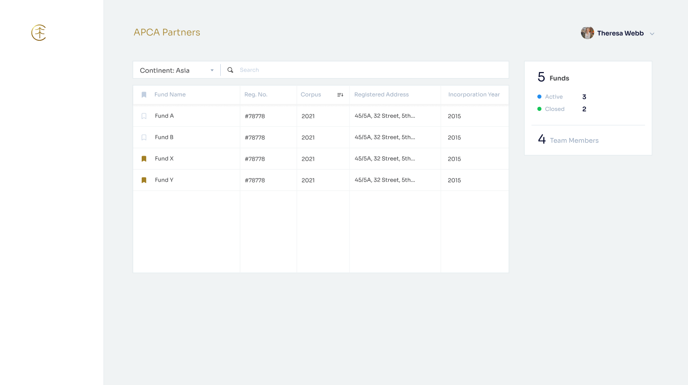

# React Development Challenge

## Description 
- This repository contains a sandboxed react application. One needs to replicate [this figma wireframe](https://www.figma.com/file/o3tz8MxxTPuRYqwf0xpXF7/CAPTL-Hiring-Snap?node-id=0%3A1) while following the current repository structure. 

- The wireframe describes the [**AllFunds**](src/pages/AllFunds) page which consists 3 major components: [**SearchBar**](src/pages/AllFunds/components/SearchBar), [**Table**](src/pages/AllFunds/components/Table), [**FundsOverview**](src/pages/AllFunds/components/FundsOverview). These 3 components have to be converted from a figma wireframe to react components. The Navigation Bar on the left can be left out blank as shown.




- Search by *Fund Name*, and Sort by *Continent* is to be implemented along with the conversion of the wireframe. Find the list of all continents [here](src/constants/Continents.js).
- Find the colors, and fonts in [theme.js](src/theme.js) file.
- Find common assets/components in the [components](src/components) folder. This includes buttons, logos, etc.
- [App.js](src/App.js), [GP.jsx](src/pages/AllFunds/GP.jsx) should not be modified.
- [GP.jsx](src/pages/AllFunds/GP.jsx) contains the data required to populate the components. No APIs have to be called to fetch data.
- Supported devices should be: *Desktop*, *iPad*, and *iPad Pro*.

## Running the App
```
npm install
npm start
``` 
The application will be live at `localhost:3000`.

## LICENSE
```
Copyright (C) 2021-2022 FirstArt Innovation LLP admin@captl.ventures 

This file is part of the CAPTL Reactapp Hiring project.

The CAPTL Reactapp Hiring project can not be copied and/or distributed without the express
permission of FirstArt Innovation LLP admin@captl.ventures.
```